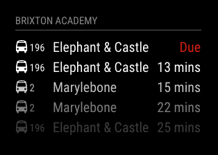
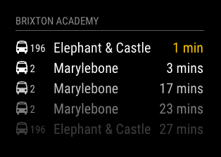

# MMM-TFL-Arrivals

This a module for the [MagicMirror](https://github.com/MichMich/MagicMirror).

This module gets real time arrival predictions for specific stops using the TfL API.




## Installation

```bash
git clone https://github.com/ryck/MMM-TFL-Arrivals.git &&
cd MMM-TFL-Arrivals &&
npm install
```

## Config

The entry in `config.js` can include the following options:

| Option             | Description                                                                                                                                                                                                                                           |
| ------------------ | ----------------------------------------------------------------------------------------------------------------------------------------------------------------------------------------------------------------------------------------------------- |
| `app_id`           | **Required** This is the App ID assigned to you on the TfL Open Data Portal. Details on how to request an App ID can be found [here](https://api.tfl.gov.uk/)<br><br>**Type:** `string`<br>                                                           |
| `app_key`          | **Required** This is the App key assigned to you on the TfL Open Data Portal. Details on how to request an App key can be found [here](https://api.tfl.gov.uk/)<br><br>**Type:** `string`<br>                                                         |
| `naptanId`         | **Required** A StopPoint id (station naptan code e.g. 940GZZLUAS). You can search for StopPoints IDs [here](http://transport-points.co.uk/index.asp?size=F)<br><br>**Type:** `string`<br>                                                             |
| `updateInterval`   | How often the arrival information is updated.<br><br>**Type:** `integer`<br>**Default value:** `1 min`                                                                                                                                                |
| `fade`             | Fade the future events to black. (Gradient) <br><br>**Type:** `bool`<br>**Possible values:** `true` or `false` <br> **Default value:** `true`                                                                                                         |
| `fadePoint`        | Where to start fade? <br><br>**Type:** `bool`<br>**Possible values:** `0` (top of the list) - `1` (bottom of list) <br> **Default value:** `0.25`                                                                                                     |
| `initialLoadDelay` | The initial delay before loading. If you have multiple modules that use the same API key, you might want to delay one of the requests. (Milliseconds) <br><br>**Type:** `integer`<br>**Possible values:** `1000` - `5000` <br> **Default value:** `0` |
| `animationSpeed`   | Speed of the update animation. (Milliseconds) <br><br>**Type:** `integer`<br>**Possible values:**`0` - `5000` <br> **Default value:** `2000` (2 seconds)                                                                                              |
| `lateThreshold`    | How many minutes is late?<br><br>**Type:** `integer`<br>**Default value:** `2 min`                                                                                                                                                                    |
| `limit`            | Number of departures to return.<br><br>**Type:** `string`<br>**Default:** 5                                                                                                                                                                           |
| `color`            | Use some accent colors for due and late status <br><br>**Type:** `bool`<br>**Possible values:** `true` or `false` <br> **Default value:** `true`                                                                                                      |
| `debug`            | Show debug information. <br><br> **Possible values:** `true` or `false` <br> **Default value:** `false`                                                                                                                                               |

Here is an example of an entry in `config.js`

```
{
	module: 'MMM-TFL-Arrivals',
	position: 'bottom_left',
	header: 'Bus Arrivals',
	config: {
		app_id: "$APPID",
		app_key: "$APPKEY",
		naptanId: "940GZZLUBLM", // StopPoint id
		animationSpeed: 1000,
		fade: true,
		fadePoint: 0.25, // Start on 1/4th of the list.
		limit: 5,
		initialLoadDelay: 0,
		color: true,
		debug: false
	}
},
```

## Dependencies

- [axios](https://www.npmjs.com/package/axios) (installed via `npm install`)

## Thanks To...

- [Nick Wootton](https://github.com/MichMich) for the [MMM-UKLiveBusStopInfo](https://github.com/nwootton/MMM-UKLiveBusStopInfo) module, which I used as reference.
- [Nigel Daniels](https://github.com/nigel-daniels/) for the [MMM-Tube-Status](https://github.com/nigel-daniels/MMM-Tube-Status) module, which I used as reference.
- [Michael Teeuw](https://github.com/MichMich) for the [MagicMirror2](https://github.com/MichMich/MagicMirror/) framework that made this module possible.
- [Transport for London](https://tfl.gov.uk) for the guides and information they publish on their API.
